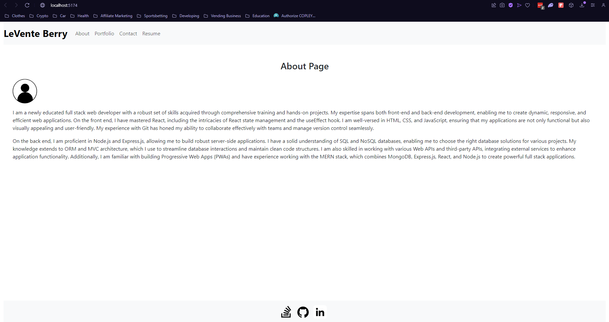

# LeVente's Portfolio

Take a look at my most recent projects with the porfolio I built utilizing React!



## Table of Contents

- [Description](#description)
- [Usage](#usage)
- [Technologies](#technologies)
- [Questions](#questions)
- [Liscence](#liscence)

## Description

This is a comprehensive developer portfolio showcasing my skills, projects, and resume. It highlights my proficiency in various technologies and provides an overview of the projects I have worked on. The portfolio is built with modern web development technologies and follows best practices to ensure responsiveness and accessibility.

## Usage

### Prerequisites

> **_NOTE:_**
> This package assumes you already have Node.js and npm installed. If you don't, [download Node.js](https://nodejs.org/en/download) first then come back to these installation steps.

### Live Production:

A live deployment of the application can be found [here](https://leventesportfolio.netlify.app).

### Local Development:

1. Open your terminal and clone the github repo:

```
git clone https://github.com/hokage-216/my-react-portfolio.git
```

2. 'cd' into the folder:

```
cd my-react-portfolio
```

3. Then run this command to install the required packages:

```
npm install
```

## Usage

After installing required packages, you can run the application in development mode:

```
npm run dev
```

For production mode, use:

```
npm run build
```

The program will start the backend server and serve the client application, allowing you to use the text editor.

## Technologies

- **Frontend**: HTML5, JavaScript, CSS, React, Bootstrap, Vite
- **Version Control**: Git and GitHub
- **Dev Tools**: ESLint, 

## Questions

If you have any questions about the repo, open an issue or contact me directly at berrylevente@hotmail.com.

To view more of my work [click here](https://github.com/hokage-216/).

## Liscence

Licensed under the MIT license. To view the license terms [click here](https://opensource.org/licenses/MIT).